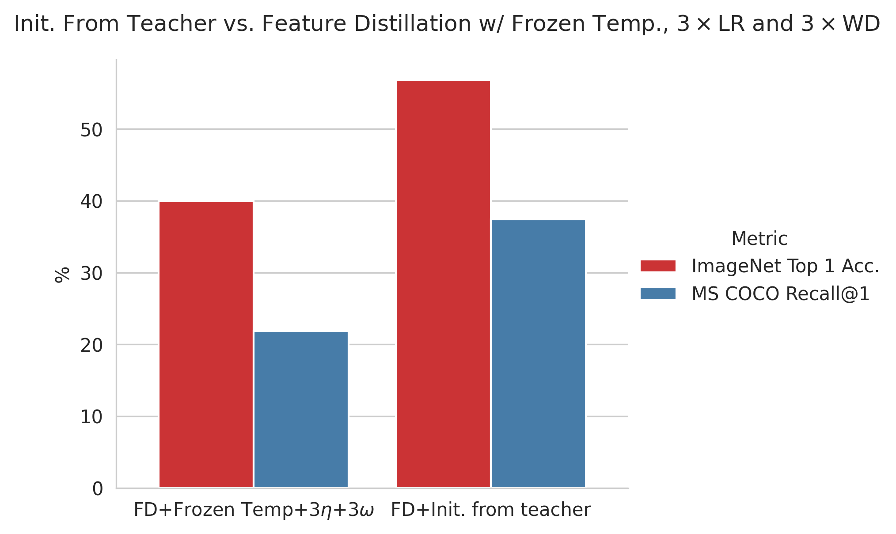

## Learning with Reference Model

In this repo, we show how to train a CLIP model by using Global Contrastive Loss (GCL) on a 1M subset of the image-text dataset [DFN-2B](https://huggingface.co/datasets/apf1/datafilteringnetworks_2b).

### Checkpoints

Our best model (FD+Init. from teacher) is available [here](https://huggingface.co/jacob-helwig/clip_with_reference/blob/main/fastclip_dist0.5feature_teacherInit_ImageNet_1k%3D0.5684-MSCOCO%3D0.3744.pt).

Our second best model (FD+frozen temp.+ $3\eta$ + $3\omega$) is available [here](https://huggingface.co/jacob-helwig/clip_with_reference/blob/main/fastclip_dist0.5feature_lockLogit100_3xLR_3xWD_ImageNet_1k%3D0.39926-MSCOCO%3D0.2180.pt).



### Environment

Setting up a new virtual environment with Conda:
````bash
env_name='fastclip'
conda create -n "$env_name" python=3.11 -y
conda activate "$env_name"
python -m pip install -r requirements-training.txt
python -m pip install -r requirements-eval.txt
````

### Training

**Data**:
```bash
mkdir datasets
# dfn_data, ~40GB
gdown --folder --output ./datasets/ 1SEhMped23ACVRzNIdgo4aI81rONqnbzi
cd ./datasets/dfn_data
for i in {0..6}; do tar xf part0${i}.tar; rm part0${i}.tar; done
cd -
```

The following command trains a ViT-B/16 CLIP model using FastCLIP on DFN on 2 GPUs, with (per-GPU) batch size 320 for 30 epochs:
```bash
export PYTHONPATH="$PYTHONPATH:$PWD/src"
export NCCL_P2P_LEVEL=NVL
export CUDA_DEVICE_ORDER=PCI_BUS_ID

export HUGGINGFACE_HUB_CACHE='./checkpoints/huggingface'
export CUDA_VISIBLE_DEVICES=2,6

effective_batch_size=640
num_gpus=$(echo $CUDA_VISIBLE_DEVICES | tr ',' '\n' | wc -l)
batch_size=$((${effective_batch_size} / ${num_gpus}))
run=true
exp_name=fastclipv3_dive9_v1


if [ ${batch_size} -lt 1 ]; then
    echo "batch size ${batch_size} is invalid"
    run=false
fi
if [ ${effective_batch_size} -ne $(( ${batch_size} * ${num_gpus} )) ]; then
    echo "batch size ${batch_size} times number of devices ${num_gpus} is not equal to effective batch size ${effective_batch_size}"
    run=false
fi


if [ $run = true ]; then
    cmd="python -m torch.distributed.run \
        --nproc_per_node=${num_gpus} --nnodes=1 --node_rank=0 \
        --rdzv-id=4204 --rdzv-backend=c10d --rdzv-endpoint='127.0.0.1' \
        src/training/main.py \
        --save-frequency 1 \
        --train-data './datasets/dfn_data/00000{000..139}.tar' \
        --datacomp-path ./datasets/datacomp \
        --train-num-samples 1000000 --data_size 1400000 \
        --warmup 500 \
        --batch-size ${batch_size} \
        --epochs 30 \
        --workers 6 \
        --model ViT-B-16 \
        --name ${exp_name} \
        --seed 2025 \
        --wd 0.2 \
        --local-loss \
        --fastclip --multiply_tau --temperature_scheme global_learnable \
        --lr 3.125e-4 --lr_tau 7.8125e-5 --lr_tau_scheduler step_thresh --rho 11.0 \
        --gamma 0.9 --gamma_schedule cosine --gamma_decay_epochs 30 \
        --report-to tensorboard" #  --grad-checkpointing"
    echo $cmd
    eval $cmd
fi
```

```
/data/jacob/anaconda3/envs/fastclip/bin/tensorboard --logdir . --port 6007
```

In src/training/main.py, we create the model, optimizer, loss, dataloader, etc. And in src/training/train.py, we do the training step by step.

To leverage the reference model from OpenAI, you need to create it with:
```python
import fast_clip

ref_model, _, _ = fast_clip.create_model_and_transforms('ViT-B-32', pretrained='openai')
```
And modify the training pipeline accordingly. `ref_model` is an instance of `CLIP` defined in src/fast_clip/model.py, where you can find its attributes and methods.

### Evaluation

**Data**:
```bash
git clone https://github.com/xywei00/datacomp.git
python ./datacomp/download_evalsets.py ./datasets/datacomp
```

To evaluate a trained CLIP model, run the following command:
```bash
# train_output_dir should be the one containing 'checkpoints', 'out.log', etc.
train_output_dir='./logs/fastclipv3'
data_dir='./datasets/datacomp'
arch='ViT-B-16'
epoch=30  # use last ckpt

CUDA_VISIBLE_DEVICES=0 python ./datacomp/evaluate.py --train_output_dir "${train_output_dir}" --data_dir "${data_dir}" --epoch "${epoch}" --arch "${arch}"
```
