# FastCLIP

```
python -m torch.distributed.run --nproc_per_node=2 --nnodes=1 --node_rank=0 --rdzv-id=4204 --rdzv-backend=c10d --rdzv-endpoint='127.0.0.1' src/training/main.py --save-frequency 1 --train-data './datasets/dfn_data/00000{000..139}.tar' --train-num-samples 1000000 --data_size 1400000 --warmup 500 --batch-size 320 --epochs 30 --workers 6 --model ViT-B-16 --name fastclipv3_dive9_v1 --seed 2025 --wd 0.2 --local-loss --fastclip --multiply_tau --temperature_scheme global_learnable --lr 3.125e-4 --lr_tau 7.8125e-5 --lr_tau_scheduler step_thresh --rho 11.0 --gamma 0.9 --gamma_schedule cosine --gamma_decay_epochs 30 --report-to tensorboard
```

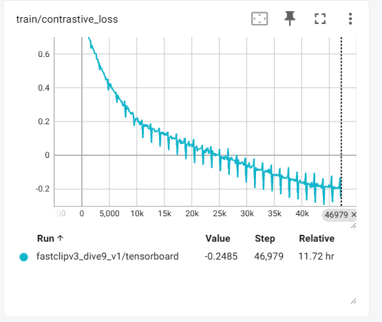
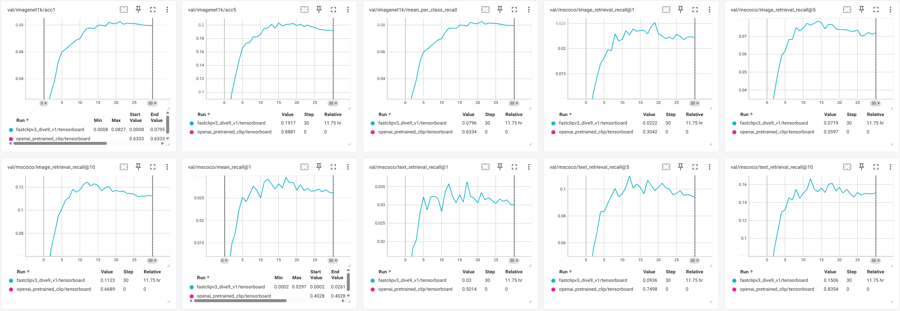

```
train_output_dir='./logs/fastclipv3_dive9_v1'
data_dir='./datasets/datacomp'
arch='ViT-B-16'
epoch=18

CUDA_VISIBLE_DEVICES=6 python ./datacomp/evaluate.py --train_output_dir "${train_output_dir}" --data_dir "${data_dir}" --epoch "${epoch}" --arch "${arch}"
```

```
=== Final results ===
MSCOCO: 0.028415114618837833
ImageNet 1k: 0.08198
```

# OpenAI CLIP

```
CUDA_VISIBLE_DEVICES=7 python -m torch.distributed.run --nproc_per_node=1 --nnodes=1 --node_rank=0 --rdzv-id=4206 --rdzv-backend=c10d --rdzv-endpoint='127.0.0.3' src/training/main.py --save-frequency 1 --train-data './datasets/dfn_data/00000{000..139}.tar' --train-num-samples 1000000 --data_size 1400000 --warmup 500 --batch-size 320 --epochs 30 --workers 6 --model ViT-B-32 --pretrained openai --name openai_pretrained_clip --seed 2025 --wd 0.2 --local-loss --fastclip --multiply_tau --temperature_scheme global_learnable --lr 3.125e-4 --lr_tau 7.8125e-5 --lr_tau_scheduler step_thresh --rho 11.0 --gamma 0.9 --gamma_schedule cosine --gamma_decay_epochs 30 --report-to tensorboard
```

```
2025-04-14,23:32:09 | INFO | Eval Epoch: 0 mscoco/image_retrieval_recall@1: 0.3042      mscoco/text_retrieval_recall@1: 0.5014  mscoco/image_retrieval_recall@5: 0.5597  mscoco/text_retrieval_recall@5: 0.7498  mscoco/image_retrieval_recall@10: 0.6689        mscoco/text_retrieval_recall@10: 0.8354  mscoco/mean_recall@1: 0.4028    imagenet1k/acc1: 0.6333 imagenet1k/acc5: 0.8881 imagenet1k/mean_per_class_recall: 0.6334
```

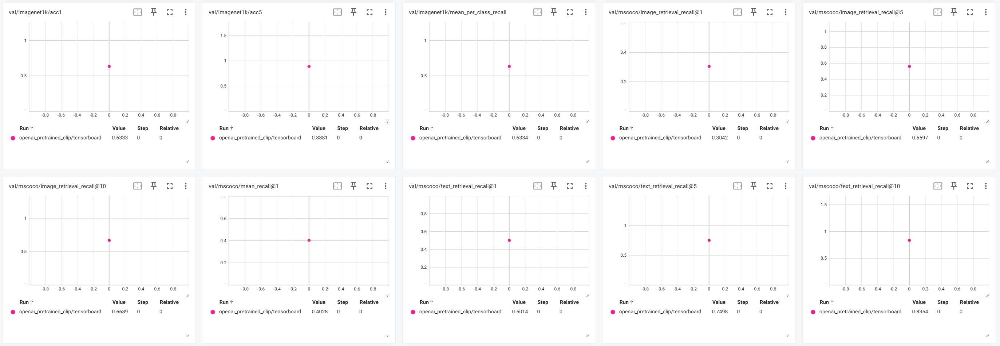

# FastCLIP + 0.5 Cross Entropy Distillation

```
CUDA_VISIBLE_DEVICES=6,7 python -m torch.distributed.run --nproc_per_node=2 --nnodes=1 --node_rank=0 --rdzv-id=4204 --rdzv-backend=c10d --rdzv-endpoint='127.0.0.1' src/training/main.py --save-frequency 1 --train-data ./datasets/dfn_data/00000{000..139}.tar --datacomp-path ./datasets/datacomp --train-num-samples 1000000 --data_size 1400000 --warmup 500 --batch-size 320 --epochs 30 --workers 6 --model ViT-B-16 --distill-model ViT-B-32 --distill-pretrained openai --distill-mode cross_entropy --distill-weight 0.5 --name fastclip_dist0.5crossEnt_dive9_v0 --seed 2025 --wd 0.2 --local-loss --fastclip --multiply_tau --temperature_scheme global_learnable --lr 3.125e-4 --lr_tau 7.8125e-5 --lr_tau_scheduler step_thresh --rho 11.0 --gamma 0.9 --gamma_schedule cosine --gamma_decay_epochs 30 --report-to tensorboard
```

# FastCLIP + 0.5 Feature Distillation

```
CUDA_VISIBLE_DEVICES=8,9 python -m torch.distributed.run --nproc_per_node=2 --nnodes=1 --node_rank=0 --rdzv-id=4204 --rdzv-backend=c10d --rdzv-endpoint='127.0.0.1:29500' src/training/main.py --save-frequency 1 --train-data "./datasets/dfn_data/00000{000..139}.tar" --datacomp-path ./datasets/datacomp --train-num-samples 1000000 --data_size 1400000 --warmup 500 --batch-size 320 --epochs 30 --workers 6 --model ViT-B-16 --distill-model ViT-B-32 --distill-pretrained openai --distill-mode feature --distill-weight 0.5 --name fastclip_dist0.5feature_dive9_v0 --seed 2025 --wd 0.2 --local-loss --fastclip --multiply_tau --temperature_scheme global_learnable --lr 3.125e-4 --lr_tau 7.8125e-5 --lr_tau_scheduler step_thresh --rho 11.0 --gamma 0.9 --gamma_schedule cosine --gamma_decay_epochs 30 --report-to tensorboard
```

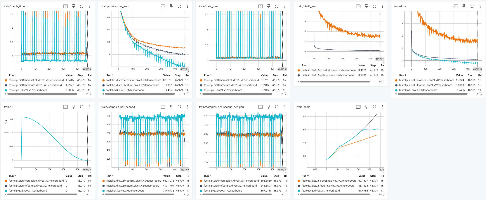
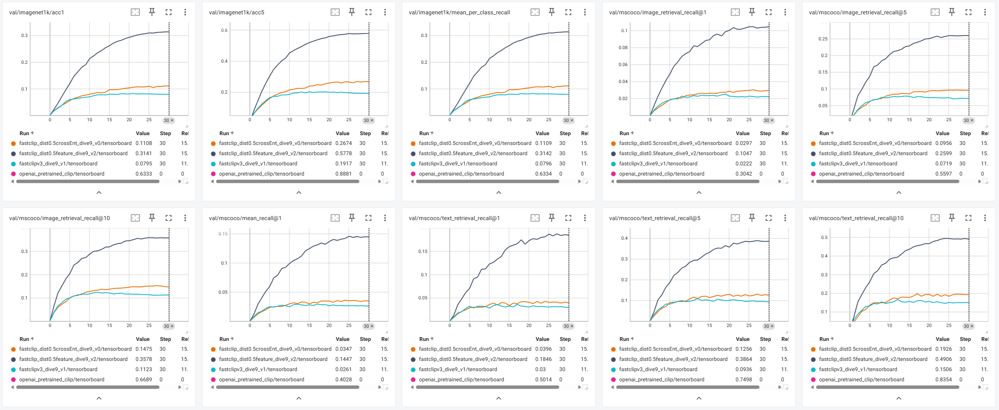

# FastCLIP + 0.5 Feature Distillation, init from distilled model + freeze text tower

```
CUDA_VISIBLE_DEVICES=0,7 python -m torch.distributed.run --nproc_per_node=2 --nnodes=1 --node_rank=0 --rdzv-id=4204 --rdzv-backend=c10d --rdzv-endpoint='127.0.0.1:29500' src/training/main.py --save-frequency 1 --train-data "./datasets/dfn_data/00000{000..139}.tar" --datacomp-path ./datasets/datacomp --train-num-samples 1000000 --data_size 1400000 --warmup 500 --batch-size 320 --epochs 30 --workers 6 --model ViT-B-16 --distill-model ViT-B-32 --distill-pretrained openai --distill-mode feature --distill-weight 0.5 --name fastclip_dist0.5feature_teacherInit_textLock_dive9_v0 --seed 2025 --wd 0.2 --local-loss --fastclip --multiply_tau --temperature_scheme global_learnable --lr 3.125e-4 --lr_tau 7.8125e-5 --lr_tau_scheduler step_thresh --rho 11.0 --gamma 0.9 --gamma_schedule cosine --gamma_decay_epochs 30 --report-to tensorboard --lock-text --init-from-distilled
```

# FastCLIP + 0.5 Feature Distillation, init from distilled model + freeze text tower + 0WD

```
CUDA_VISIBLE_DEVICES=0,7 python -m torch.distributed.run --nproc_per_node=2 --nnodes=1 --node_rank=0 --rdzv-id=4204 --rdzv-backend=c10d --rdzv-endpoint='127.0.0.1:29500' src/training/main.py --save-frequency 1 --train-data "./datasets/dfn_data/00000{000..139}.tar" --datacomp-path ./datasets/datacomp --train-num-samples 1000000 --data_size 1400000 --warmup 500 --batch-size 320 --epochs 30 --workers 6 --model ViT-B-16 --distill-model ViT-B-32 --distill-pretrained openai --distill-mode feature --distill-weight 0.5 --name fastclip_dist0.5feature_teacherInit_textLock_wd0_dive9_v0 --seed 2025 --wd 0. --local-loss --fastclip --multiply_tau --temperature_scheme global_learnable --lr 3.125e-4 --lr_tau 7.8125e-5 --lr_tau_scheduler step_thresh --rho 11.0 --gamma 0.9 --gamma_schedule cosine --gamma_decay_epochs 30 --report-to tensorboard --lock-text --init-from-distilled
```

# FastCLIP + 0.5 Feature Distillation, init from distilled model 

```
CUDA_VISIBLE_DEVICES=3,4 python -m torch.distributed.run --nproc_per_node=2 --nnodes=1 --node_rank=0 --rdzv-id=4204 --rdzv-backend=c10d --rdzv-endpoint='127.0.0.1:29400' src/training/main.py --save-frequency 1 --train-data "./datasets/dfn_data/00000{000..139}.tar" --datacomp-path ./datasets/datacomp --train-num-samples 1000000 --data_size 1400000 --warmup 500 --batch-size 320 --epochs 30 --workers 6 --model ViT-B-16 --distill-model ViT-B-32 --distill-pretrained openai --distill-mode feature --distill-weight 0.5 --name fastclip_dist0.5feature_teacherInit_dive9_v0 --seed 2025 --wd 0.2 --local-loss --fastclip --multiply_tau --temperature_scheme global_learnable --lr 3.125e-4 --lr_tau 7.8125e-5 --lr_tau_scheduler step_thresh --rho 11.0 --gamma 0.9 --gamma_schedule cosine --gamma_decay_epochs 30 --report-to tensorboard --init-from-distilled
```

```
train_output_dir='/mnt/data/shared/jacob/clip_with_reference/logs/fastclip_dist0.5feature_teacherInit_dive9_v0/fastclip_dist0.5feature_teacherInit_dive9_v0'
data_dir='/mnt/data/shared/jacob/clip_with_reference/datasets/datacomp'
arch='ViT-B-16'
epoch=30

CUDA_VISIBLE_DEVICES=7 python ./datacomp/evaluate.py --train_output_dir "${train_output_dir}" --data_dir "${data_dir}" --epoch "${epoch}" --arch "${arch}"
```


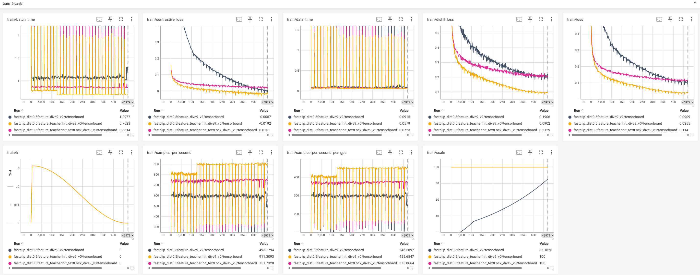
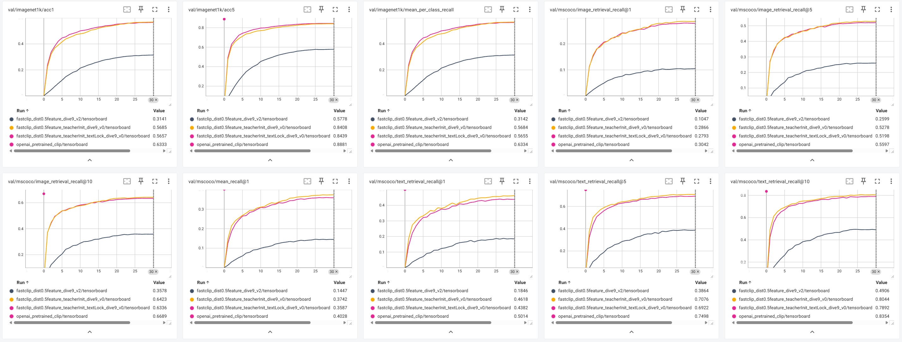


# FastCLIP + 0.5 Feature Distillation + lock logit scale to 100

```
CUDA_VISIBLE_DEVICES=6,7 python -m torch.distributed.run --nproc_per_node=2 --nnodes=1 --node_rank=0 --rdzv-id=4204 --rdzv-backend=c10d --rdzv-endpoint='127.0.0.1:29500' src/training/main.py --save-frequency 1 --train-data "./datasets/dfn_data/00000{000..139}.tar" --datacomp-path ./datasets/datacomp --train-num-samples 1000000 --data_size 1400000 --warmup 500 --batch-size 320 --epochs 30 --workers 6 --model ViT-B-16 --distill-model ViT-B-32 --distill-pretrained openai --distill-mode feature --distill-weight 0.5 --name fastclip_dist0.5feature_lockLogit100_dive9_v0 --seed 2025 --wd 0.2 --local-loss --fastclip --multiply_tau --temperature_scheme global_learnable --lr 3.125e-4 --lr_tau 7.8125e-5 --lr_tau_scheduler step_thresh --rho 11.0 --gamma 0.9 --gamma_schedule cosine --gamma_decay_epochs 30 --report-to tensorboard --temperature 0.01 --lock-logit-scale
```

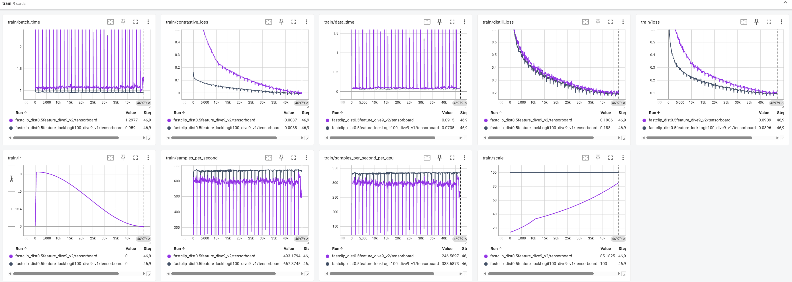
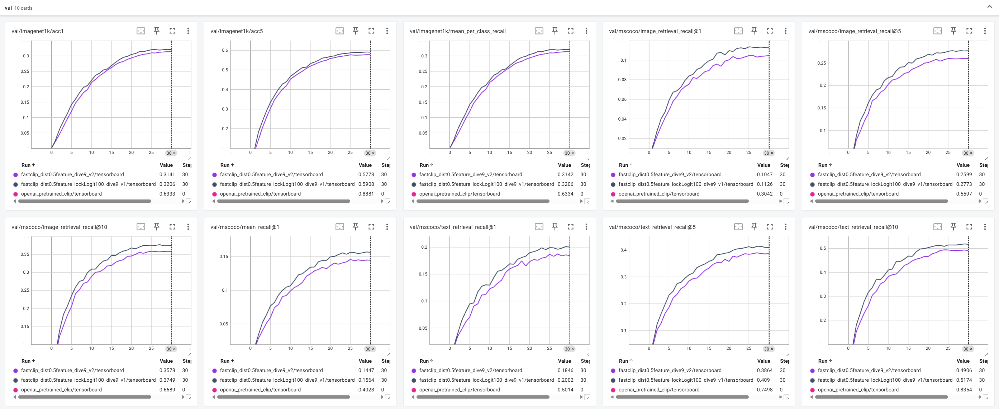

# FastCLIP + 0.5 KL + lock logit scale to 100

```
CUDA_VISIBLE_DEVICES=2,3,4,5,6 python -m torch.distributed.run --nproc_per_node=5 --nnodes=1 --node_rank=0 --rdzv-id=4204 --rdzv-backend=c10d --rdzv-endpoint='127.0.0.1:29400' src/training/main.py --save-frequency 1 --train-data "./datasets/dfn_data/00000{000..139}.tar" --datacomp-path ./datasets/datacomp --train-num-samples 1000000 --data_size 1400000 --warmup 500 --batch-size 128 --epochs 30 --workers 6 --model ViT-B-16 --distill-model ViT-B-32 --distill-pretrained openai --distill-mode kl --distill-weight 0.5 --name fastclip_dist0.5kl_lockLogit100_dive9_v2 --seed 2025 --wd 0.2 --local-loss --fastclip --multiply_tau --temperature_scheme global_learnable --lr 3.125e-4 --lr_tau 7.8125e-5 --lr_tau_scheduler step_thresh --rho 11.0 --gamma 0.9 --gamma_schedule cosine --gamma_decay_epochs 30 --report-to tensorboard --temperature 0.01 --lock-logit-scale
```

# FastCLIP + 0.5 Interactive + lock logit scale to 100

```
CUDA_VISIBLE_DEVICES=5,9 python -m torch.distributed.run --nproc_per_node=2 --nnodes=1 --node_rank=0 --rdzv-id=4204 --rdzv-backend=c10d --rdzv-endpoint='127.0.0.1:29400' src/training/main.py --save-frequency 1 --train-data "./datasets/dfn_data/00000{000..139}.tar" --datacomp-path ./datasets/datacomp --train-num-samples 1000000 --data_size 1400000 --warmup 500 --batch-size 320 --epochs 30 --workers 6 --model ViT-B-16 --distill-model ViT-B-32 --distill-pretrained openai --distill-mode interactive --distill-weight 0.5 --name fastclip_dist0.5interactive_lockLogit100_dive8_v0 --seed 2025 --wd 0.2 --local-loss --fastclip --multiply_tau --temperature_scheme global_learnable --lr 3.125e-4 --lr_tau 7.8125e-5 --lr_tau_scheduler step_thresh --rho 11.0 --gamma 0.9 --gamma_schedule cosine --gamma_decay_epochs 30 --report-to tensorboard --temperature 0.01 --lock-logit-scale --grad-checkpointing
```

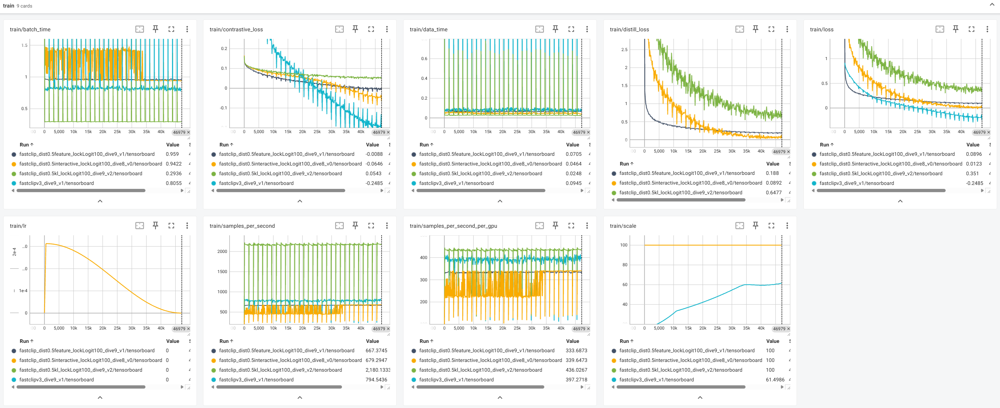
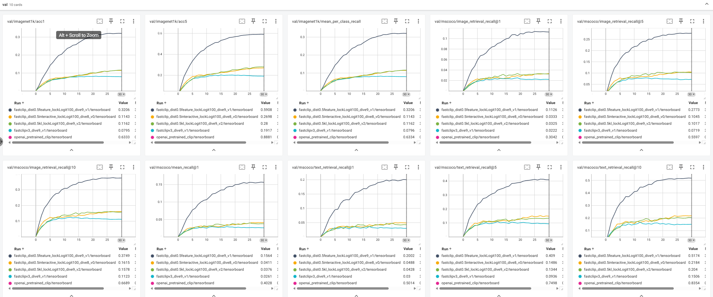

# FastCLIP + 0.5 Feature Distillation + lock logit scale to 100 + 2xlr

```
CUDA_VISIBLE_DEVICES=0,7 python -m torch.distributed.run --nproc_per_node=2 --nnodes=1 --node_rank=0 --rdzv-id=4204 --rdzv-backend=c10d --rdzv-endpoint='127.0.0.1:29400' src/training/main.py --save-frequency 1 --train-data "./datasets/dfn_data/00000{000..139}.tar" --datacomp-path ./datasets/datacomp --train-num-samples 1000000 --data_size 1400000 --warmup 500 --batch-size 320 --epochs 30 --workers 6 --model ViT-B-16 --distill-model ViT-B-32 --distill-pretrained openai --distill-mode feature --distill-weight 0.5 --name fastclip_dist0.5feature_lockLogit100_2xLR_dive9_v0 --seed 2025 --wd 0.2 --local-loss --fastclip --multiply_tau --temperature_scheme global_learnable --lr 7.25e-4 --lr_tau 7.8125e-5 --lr_tau_scheduler step_thresh --rho 11.0 --gamma 0.9 --gamma_schedule cosine --gamma_decay_epochs 30 --report-to tensorboard --temperature 0.01 --lock-logit-scale
```

# FastCLIP + 0.5 Feature Distillation + lock logit scale to 100 + 3xlr

```
CUDA_VISIBLE_DEVICES=2,3,4,5,6 python -m torch.distributed.run --nproc_per_node=5 --nnodes=1 --node_rank=0 --rdzv-id=4204 --rdzv-backend=c10d --rdzv-endpoint='127.0.0.1:29300' src/training/main.py --save-frequency 1 --train-data "./datasets/dfn_data/00000{000..139}.tar" --datacomp-path ./datasets/datacomp --train-num-samples 1000000 --data_size 1400000 --warmup 500 --batch-size 128 --epochs 30 --workers 6 --model ViT-B-16 --distill-model ViT-B-32 --distill-pretrained openai --distill-mode feature --distill-weight 0.5 --name fastclip_dist0.5feature_lockLogit100_3xLR_dive9_v0 --seed 2025 --wd 0.2 --local-loss --fastclip --multiply_tau --temperature_scheme global_learnable --lr 9.375e-4 --lr_tau 7.8125e-5 --lr_tau_scheduler step_thresh --rho 11.0 --gamma 0.9 --gamma_schedule cosine --gamma_decay_epochs 30 --report-to tensorboard --temperature 0.01 --lock-logit-scale
```

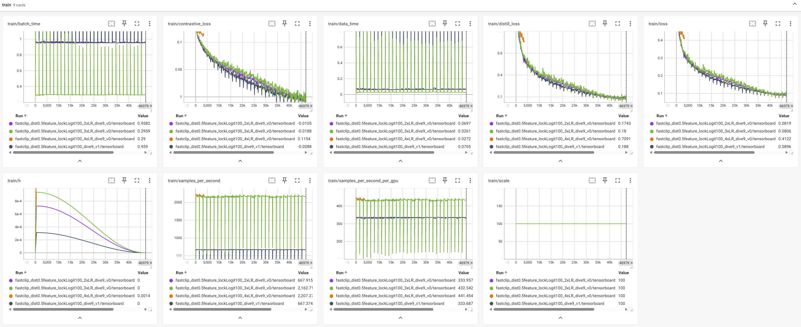
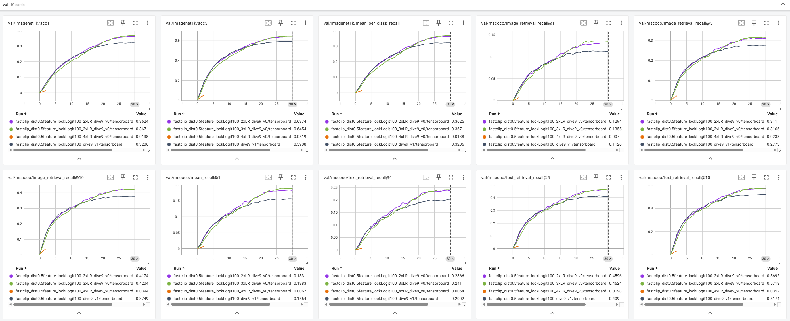

# FastCLIP + 0.5 Feature Distillation + lock logit scale to 100 + wd 0

```
CUDA_VISIBLE_DEVICES=2,3,4,5,6 python -m torch.distributed.run --nproc_per_node=5 --nnodes=1 --node_rank=0 --rdzv-id=4204 --rdzv-backend=c10d --rdzv-endpoint='127.0.0.1:29500' src/training/main.py --save-frequency 1 --train-data "./datasets/dfn_data/00000{000..139}.tar" --datacomp-path ./datasets/datacomp --train-num-samples 1000000 --data_size 1400000 --warmup 500 --batch-size 128 --epochs 30 --workers 6 --model ViT-B-16 --distill-model ViT-B-32 --distill-pretrained openai --distill-mode feature --distill-weight 0.5 --name fastclip_dist0.5feature_lockLogit100_wd0_dive9_v0 --seed 2025 --wd 0.0 --local-loss --fastclip --multiply_tau --temperature_scheme global_learnable --lr 3.125e-4 --lr_tau 7.8125e-5 --lr_tau_scheduler step_thresh --rho 11.0 --gamma 0.9 --gamma_schedule cosine --gamma_decay_epochs 30 --report-to tensorboard --temperature 0.01 --lock-logit-scale
```


# FastCLIP + 0.5 Feature Distillation + lock logit scale to 100 + 2xlr + 2xWD

```
CUDA_VISIBLE_DEVICES=0,7 python -m torch.distributed.run --nproc_per_node=2 --nnodes=1 --node_rank=0 --rdzv-id=4204 --rdzv-backend=c10d --rdzv-endpoint='127.0.0.1:29400' src/training/main.py --save-frequency 1 --train-data "./datasets/dfn_data/00000{000..139}.tar" --datacomp-path ./datasets/datacomp --train-num-samples 1000000 --data_size 1400000 --warmup 500 --batch-size 320 --epochs 30 --workers 6 --model ViT-B-16 --distill-model ViT-B-32 --distill-pretrained openai --distill-mode feature --distill-weight 0.5 --name fastclip_dist0.5feature_lockLogit100_2xlrWD_dive9_v0 --seed 2025 --wd 0.4 --local-loss --fastclip --multiply_tau --temperature_scheme global_learnable --lr 7.25e-4 --lr_tau 7.8125e-5 --lr_tau_scheduler step_thresh --rho 11.0 --gamma 0.9 --gamma_schedule cosine --gamma_decay_epochs 30 --report-to tensorboard --temperature 0.01 --lock-logit-scale
```

# FastCLIP + 0.5 Feature Distillation + lock logit scale to 100 + 3xlr + 2xWD

```
CUDA_VISIBLE_DEVICES=2,3,4,5,6 python -m torch.distributed.run --nproc_per_node=5 --nnodes=1 --node_rank=0 --rdzv-id=4204 --rdzv-backend=c10d --rdzv-endpoint='127.0.0.1:29300' src/training/main.py --save-frequency 1 --train-data "./datasets/dfn_data/00000{000..139}.tar" --datacomp-path ./datasets/datacomp --train-num-samples 1000000 --data_size 1400000 --warmup 500 --batch-size 128 --epochs 30 --workers 6 --model ViT-B-16 --distill-model ViT-B-32 --distill-pretrained openai --distill-mode feature --distill-weight 0.5 --name fastclip_dist0.5feature_lockLogit100_3xLR_2xWD_dive9_v0 --seed 2025 --wd 0.4 --local-loss --fastclip --multiply_tau --temperature_scheme global_learnable --lr 9.375e-4 --lr_tau 7.8125e-5 --lr_tau_scheduler step_thresh --rho 11.0 --gamma 0.9 --gamma_schedule cosine --gamma_decay_epochs 30 --report-to tensorboard --temperature 0.01 --lock-logit-scale
```

# FastCLIP + 0.5 Feature Distillation + lock logit scale to 100 + 3xlr + 3xWD

```
CUDA_VISIBLE_DEVICES=2,3 python -m torch.distributed.run --nproc_per_node=2 --nnodes=1 --node_rank=0 --rdzv-id=4204 --rdzv-backend=c10d --rdzv-endpoint='127.0.0.1:29300' src/training/main.py --save-frequency 1 --train-data "./datasets/dfn_data/00000{000..139}.tar" --datacomp-path ./datasets/datacomp --train-num-samples 1000000 --data_size 1400000 --warmup 500 --batch-size 320 --epochs 30 --workers 6 --model ViT-B-16 --distill-model ViT-B-32 --distill-pretrained openai --distill-mode feature --distill-weight 0.5 --name fastclip_dist0.5feature_lockLogit100_3xLR_3xWD_dive9_v0 --seed 2025 --wd 0.6 --local-loss --fastclip --multiply_tau --temperature_scheme global_learnable --lr 9.375e-4 --lr_tau 7.8125e-5 --lr_tau_scheduler step_thresh --rho 11.0 --gamma 0.9 --gamma_schedule cosine --gamma_decay_epochs 30 --report-to tensorboard --temperature 0.01 --lock-logit-scale
```

```
train_output_dir='/mnt/data/shared/jacob/clip_with_reference/logs/fastclip_dist0.5feature_lockLogit100_3xLR_3xWD_dive9_v0'
data_dir='/mnt/data/shared/jacob/clip_with_reference/datasets/datacomp'
arch='ViT-B-16'
epoch=29

CUDA_VISIBLE_DEVICES=6 python ./datacomp/evaluate.py --train_output_dir "${train_output_dir}" --data_dir "${data_dir}" --epoch "${epoch}" --arch "${arch}"
```

# FastCLIP + 0.5 Feature Distillation + lock logit scale to 100 + 4xlr + 3xWD

```
CUDA_VISIBLE_DEVICES=2,3 python -m torch.distributed.run --nproc_per_node=2 --nnodes=1 --node_rank=0 --rdzv-id=4204 --rdzv-backend=c10d --rdzv-endpoint='127.0.0.1:29300' src/training/main.py --save-frequency 1 --train-data "./datasets/dfn_data/00000{000..139}.tar" --datacomp-path ./datasets/datacomp --train-num-samples 1000000 --data_size 1400000 --warmup 500 --batch-size 320 --epochs 30 --workers 6 --model ViT-B-16 --distill-model ViT-B-32 --distill-pretrained openai --distill-mode feature --distill-weight 0.5 --name fastclip_dist0.5feature_lockLogit100_4xLR_3xWD_dive9_v0 --seed 2025 --wd 0.6 --local-loss --fastclip --multiply_tau --temperature_scheme global_learnable --lr 0.00125 --lr_tau 7.8125e-5 --lr_tau_scheduler step_thresh --rho 11.0 --gamma 0.9 --gamma_schedule cosine --gamma_decay_epochs 30 --report-to tensorboard --temperature 0.01 --lock-logit-scale
```

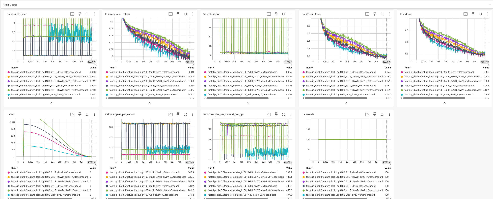


# FastCLIP + 0.5 Feature Distillation, init from distilled model + freeze text tower + 3xlr + 2xWD

```
CUDA_VISIBLE_DEVICES=2,3 python -m torch.distributed.run --nproc_per_node=2 --nnodes=1 --node_rank=0 --rdzv-id=4204 --rdzv-backend=c10d --rdzv-endpoint='127.0.0.1:29500' src/training/main.py --save-frequency 1 --train-data ./datasets/dfn_data/00000{000..139}.tar --datacomp-path ./datasets/datacomp --train-num-samples 1000000 --data_size 1400000 --warmup 500 --batch-size 320 --epochs 30 --workers 6 --model ViT-B-16 --distill-model ViT-B-32 --distill-pretrained openai --distill-mode feature --distill-weight 0.5 --name fastclip_dist0.5feature_teacherInit_textLock_2xWD_2xlr_dive9_v0 --seed 2025 --wd 0.4 --local-loss --fastclip --multiply_tau --temperature_scheme global_learnable --lr 0.00125 --lr_tau 7.8125e-5 --lr_tau_scheduler step_thresh --rho 11.0 --gamma 0.9 --gamma_schedule cosine --gamma_decay_epochs 30 --report-to tensorboard --lock-text --init-from-distilled
```

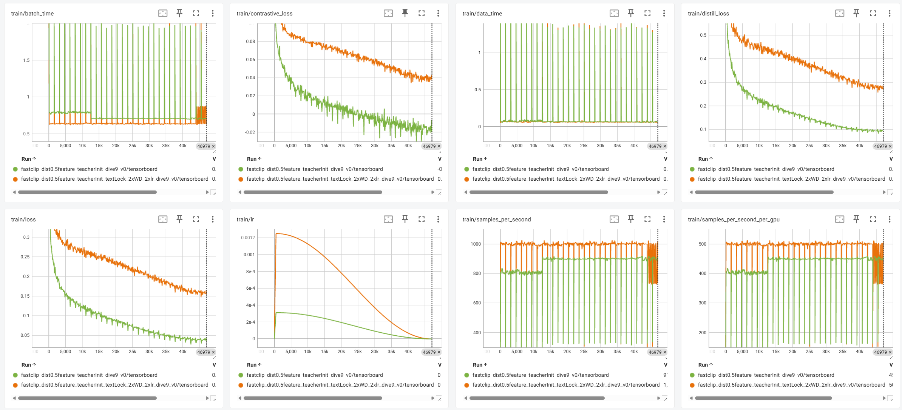
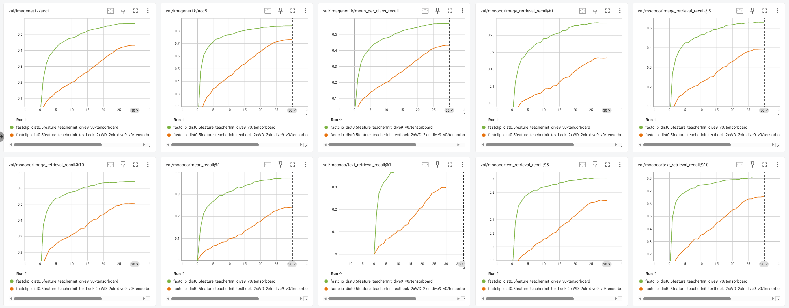

# FastCLIP + 0.8 Feature Distillation + lock logit scale to 100

```
CUDA_VISIBLE_DEVICES=2,3,4,5,6 python -m torch.distributed.run --nproc_per_node=5 --nnodes=1 --node_rank=0 --rdzv-id=4204 --rdzv-backend=c10d --rdzv-endpoint='127.0.0.1:29300' src/training/main.py --save-frequency 1 --train-data "./datasets/dfn_data/00000{000..139}.tar" --datacomp-path ./datasets/datacomp --train-num-samples 1000000 --data_size 1400000 --warmup 500 --batch-size 128 --epochs 30 --workers 6 --model ViT-B-16 --distill-model ViT-B-32 --distill-pretrained openai --distill-mode feature --distill-weight 0.8 --name fastclip_dist0.8feature_lockLogit100_dive9_v0 --seed 2025 --wd 0.2 --local-loss --fastclip --multiply_tau --temperature_scheme global_learnable --lr 3.125e-4 --lr_tau 7.8125e-5 --lr_tau_scheduler step_thresh --rho 11.0 --gamma 0.9 --gamma_schedule cosine --gamma_decay_epochs 30 --report-to tensorboard --temperature 0.01 --lock-logit-scale
```


