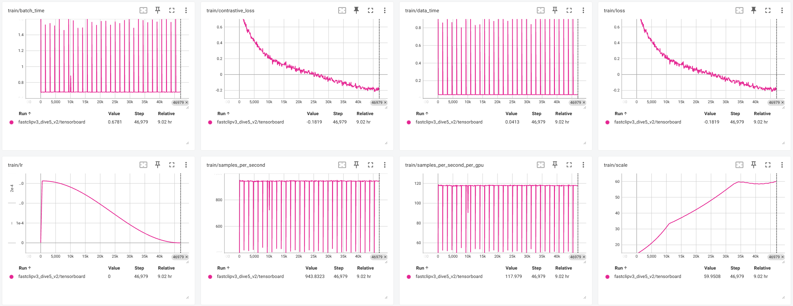

# Template: Run title here

Date: Date here

Train Command:

```
<command here>
```

Train Logs:

Train TB here

Eval Command: 

```
<command here>
```

Eval Out:

```
<final lines of eval here>
```

Commit: `<commit hash here>`


# Initial run vanilla fastCLIP

Date: 4/12/25

Train Command:

```
python -m torch.distributed.run --nproc_per_node=8 --nnodes=1 --node_rank=0 --rdzv-id=4204 --rdzv-backend=c10d --rdzv-endpoint='127.0.0.1' src/training/main.py --save-frequency 1 --train-data './datasets/dfn_data/00000{000..139}.tar' --train-num-samples 1000000 --data_size 1400000 --warmup 500 --batch-size 80 --epochs 30 --workers 6 --model ViT-B-16 --name fastclipv3_dive5_v2 --seed 2025 --wd 0.2 --local-loss --fastclip --multiply_tau --temperature_scheme global_learnable --lr 3.125e-4 --lr_tau 7.8125e-5 --lr_tau_scheduler step_thresh --rho 11.0 --gamma 0.9 --gamma_schedule cosine --gamma_decay_epochs 30 --report-to tensorboard
```

Train Logs:



Eval Command: 

```
train_output_dir='./logs/fastclipv3_dive5_v2'
data_dir='./datasets/datacomp'
arch='ViT-B-16'
epoch=30  # use last ckpt

CUDA_VISIBLE_DEVICES=0 python ./datacomp/evaluate.py --train_output_dir "${train_output_dir}" --data_dir "${data_dir}" --epoch "${epoch}" --arch "${arch}"
```

Eval Out:

```
=== Final results ===
ImageNet 1k: 0.07996
MSCOCO: 0.029355376958847046
```

Commit: `449c2abb36992815f35b3d493850a7c587e0b1ec`


